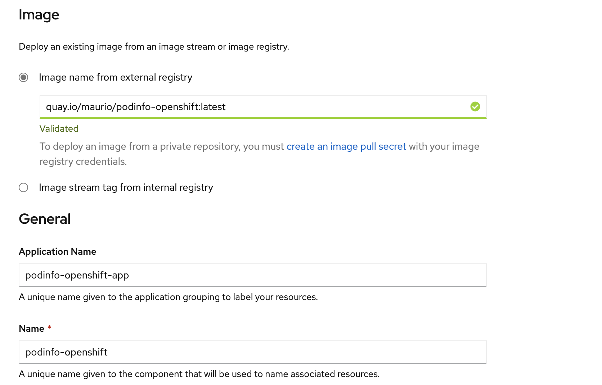
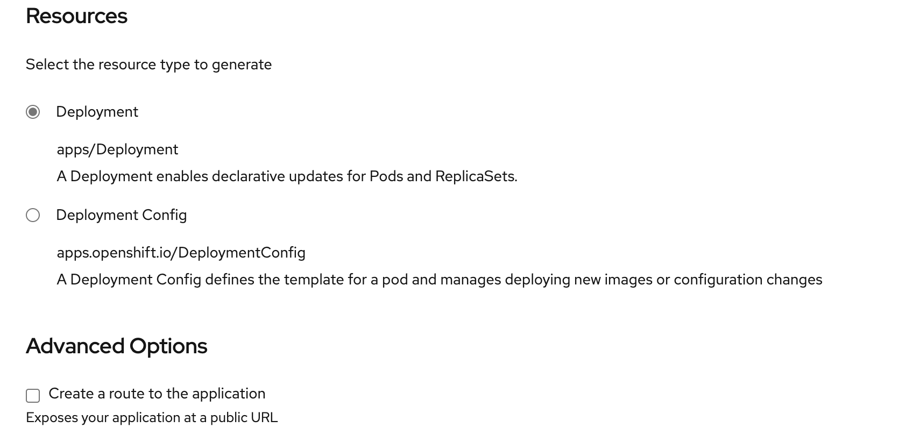

# Desplegando una Aplicacion 

<p1> Vamos a desplegar nuestra primera aplicación.  
Para esto vamos a usar una imagen ya preparada disponible en la registry de [Quay](quay.io).  
La imagen a utlizar es: [PODInfo](quay.io/maurio/podinfo:latest)</p1>

## Introducción a Containers y PODs

<p1>
En Openshift / Kubernetes, la unidad mas pequeña deployable es el POD. Un POD es un grupo de uno o mas containers desplegados juntos, garantizando que estarán en el mismo host.  

Extracto de la documentación Oficial de RedHat

> Each Pod has its own IP address, therefore owning its entire port space, and containers within pods can share storage. Pods can be "tagged" with one or more labels, which are then used to select and manage groups of pods in a single operation.

El objetivo inicial del POD es la de almacenar el "proceso principal" y los servicios auxiliares que queremos correr junto con ese proceso principal. Un ejemplo es un POD con un container de Apache como proceso principal y un container de memcache para almacenar sesiones, como proceso auxliar.  
</p1>

## Desplegando nuestra primera aplicación 
----

### Usando la Developer Console

Dentro del proyecto vamos a **Topology** luego **ADD**

  

  

  

  

Vamos a agregar algunas etiquetas para agrupar los objetos e identificarlos.  

