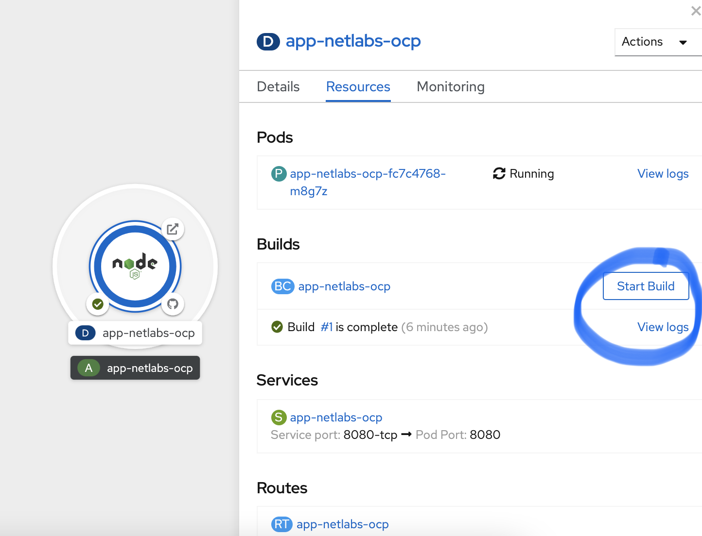

# Cambios en la Aplicación

Este procedimiento de construcción hace que podamos modificar la aplicación desde el código y ejecutar nuevamente el procedimiento de build. Esta acción puede ser automatica o manual.  
* Si es automática, implica que haya un pipeline o webhook de Git que **lance** el procedimiento de build.  
* Si es manual, basta con ir al botón **Start Build** desde la interfaz de Developer.  

