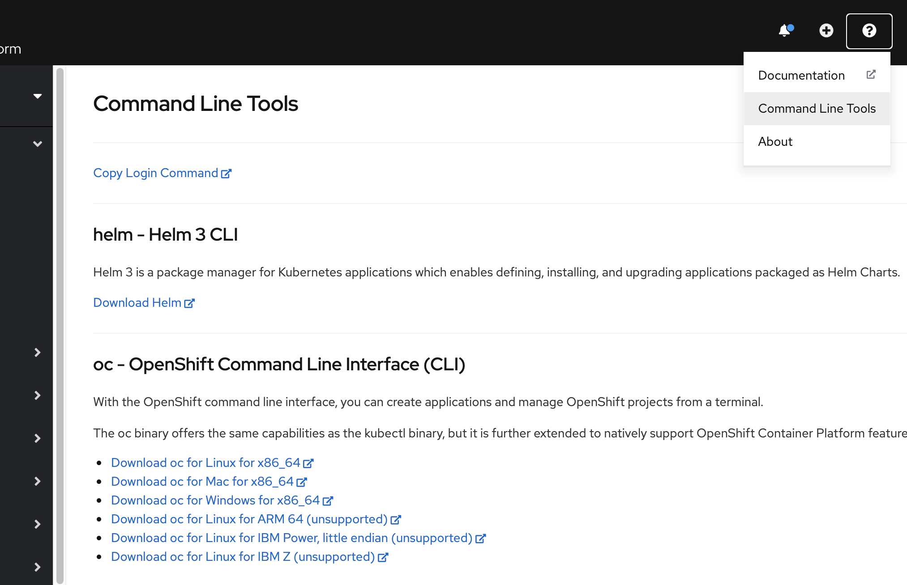
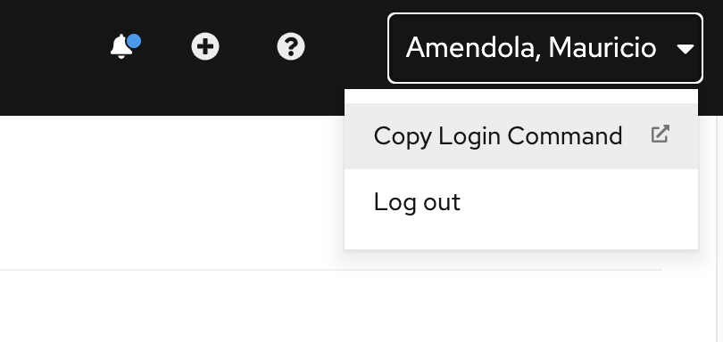

# Explorando Openshift

## Terminal de linea de comandos

### Cliente OC

Para instalar el cliente de Openshift (oc) basta con ir al simbolo de "?" al lado de la cuenta de usuario y luego a la opción "Command line tools".

  

### Cliente kubectl

Todas las operaciones contra las APIs nativas de Kubernetes se pueden efectuar usando el cliente de Kubernetes (kubectl).  
Para descargar el cliente se puede hacer desde la web del proyecto [Kubernetes](https://kubernetes.io).

[Cliente Linux](https://v1-16.docs.kubernetes.io/docs/tasks/tools/install-kubectl/#install-kubectl-binary-with-curl-on-linux)  
[Cliente MacOS](https://v1-16.docs.kubernetes.io/docs/tasks/tools/install-kubectl/#install-kubectl-on-macos)  
[Cliente Windows](https://v1-16.docs.kubernetes.io/docs/tasks/tools/install-kubectl/#install-kubectl-on-windows)    


## Conectarse a Openshift con el cliente OC

Podemos autenticarnos usando credenciales o usando un token

#### Credenciales

```bash
oc login -u user --server=https://api-url:port
```

#### Token

Para obtener el token:

  

```bash
oc login --token=some_token --server=https://api-url:port
```


