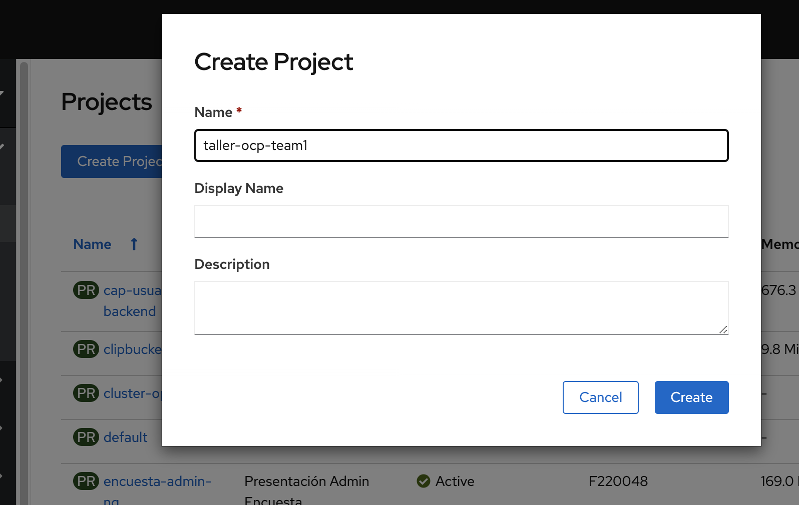

# Proyectos / Namespaces

Los proyectos brinda un mecanismo de agrupar objetos y de organizar Deployments. Un proyecto de Openshift proveé al usuario o grupo de usuarios aislamiento de objetos de otros proyectos. 
Cada proyecto tiene sus propios recursos, politicas de seguridad y networking, restricciones en cuanto al uso de recursos, etc. Actuan como un wrapper para agrupar servicios.

## Crear un proyecto

Vamos a crear un proyecto de nombre **taller-ocp-teamX** donde teamX es el numero de equipo.  

Desde la consola Web:  

  

Desde la terminal de comandos:

```bash
oc new-project taller-ocp-team1

Now using project "taller-ocp-team1" on server "https://openshift-server:port".

You can add applications to this project with the 'new-app' command. For example, try:

    oc new-app django-psql-example

to build a new example application in Python. Or use kubectl to deploy a simple Kubernetes application:

    kubectl create deployment hello-node --image=gcr.io/hello-minikube-zero-install/hello-node

````


