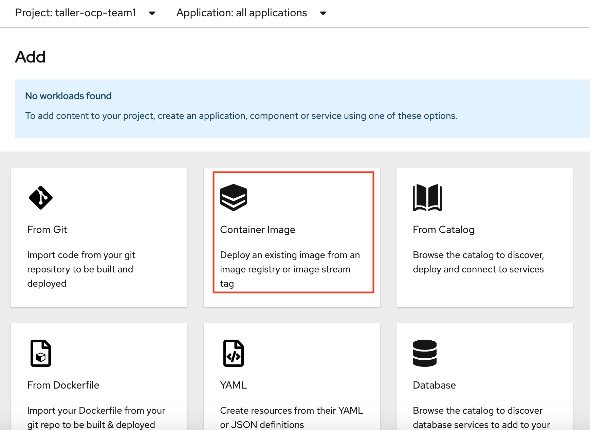
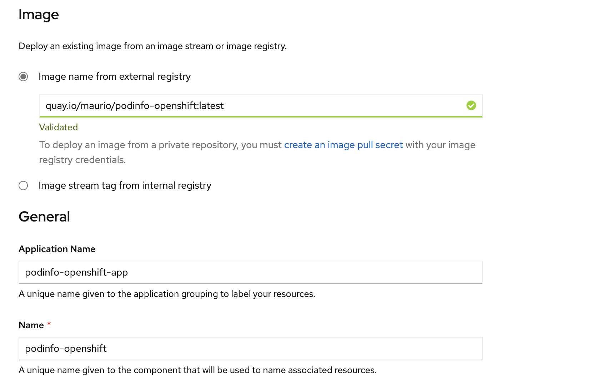
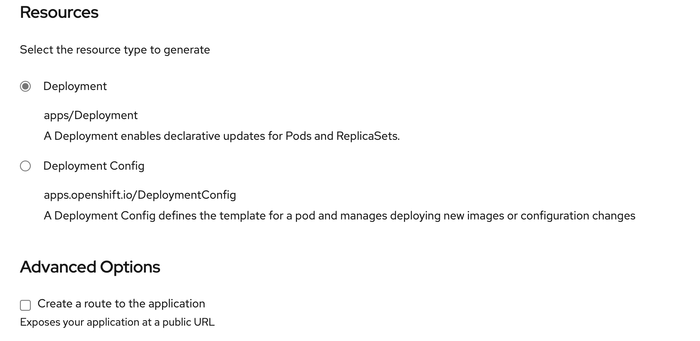
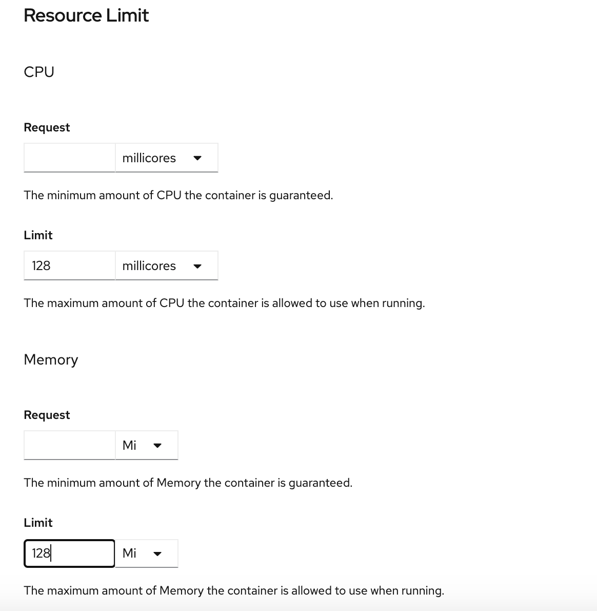
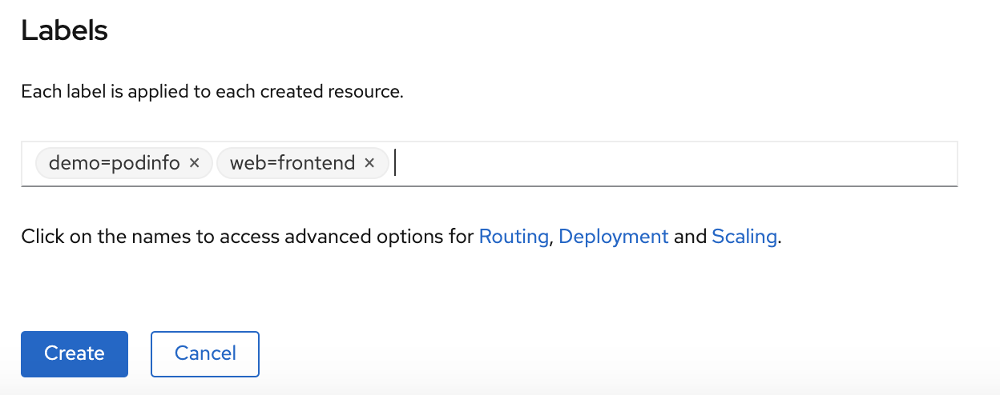

# Desplegando nuestra primera aplicación 

## Usando la Developer Console </h3>

Dentro del proyecto vamos a **Topology** luego **ADD**

  

  

  

  

Vamos a agregar algunas etiquetas para agrupar los objetos e identificarlos.  



## Usando la Cli

```yaml
 oc run podinfo --image=quay.io/maurio/podinfo-openshift:latest

 kubectl run --generator=deploymentconfig/v1 is DEPRECATED and will be removed in a future version. Use kubectl run --generator=run-pod/v1 or kubectl create instead.

deploymentconfig.apps.openshift.io/podinfo created

 ```

Este comando crea los siguientes objetos

* Un deployment / deploymentconfig
* Un replicationcontroller / replicaset
* un POD con la app (previamente crea un pod de deploy)

````
oc get all
NAME                   READY   STATUS      RESTARTS   AGE
pod/podinfo-1-deploy   0/1     Completed   0          3m49s
pod/podinfo-1-pclzw    1/1     Running     0          3m44s

NAME                              DESIRED   CURRENT   READY   AGE
replicationcontroller/podinfo-1   1         1         1       3m49s

NAME                                         REVISION   DESIRED   CURRENT   TRIGGERED BY
deploymentconfig.apps.openshift.io/podinfo   1          1         1         config
````
