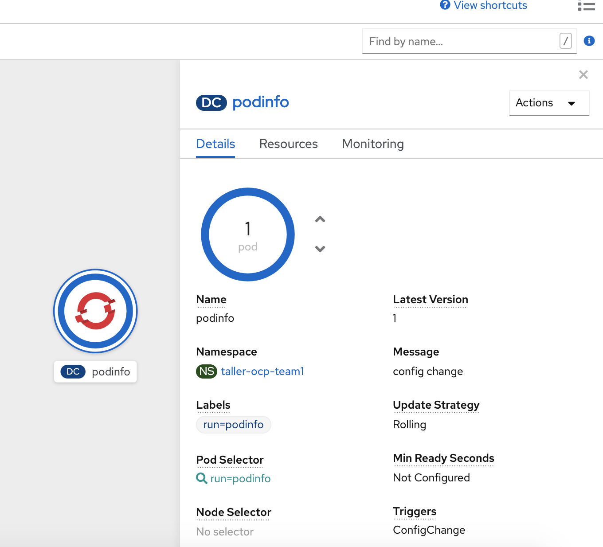
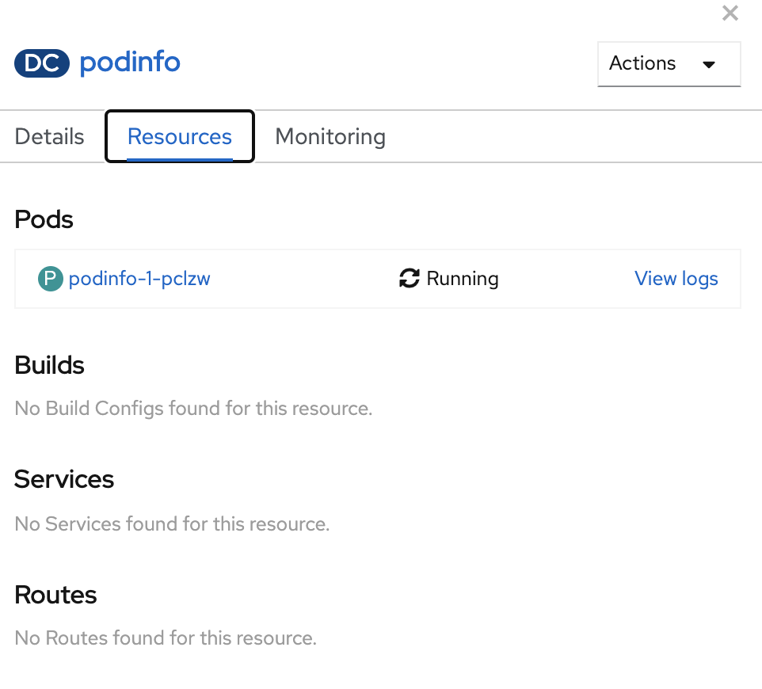
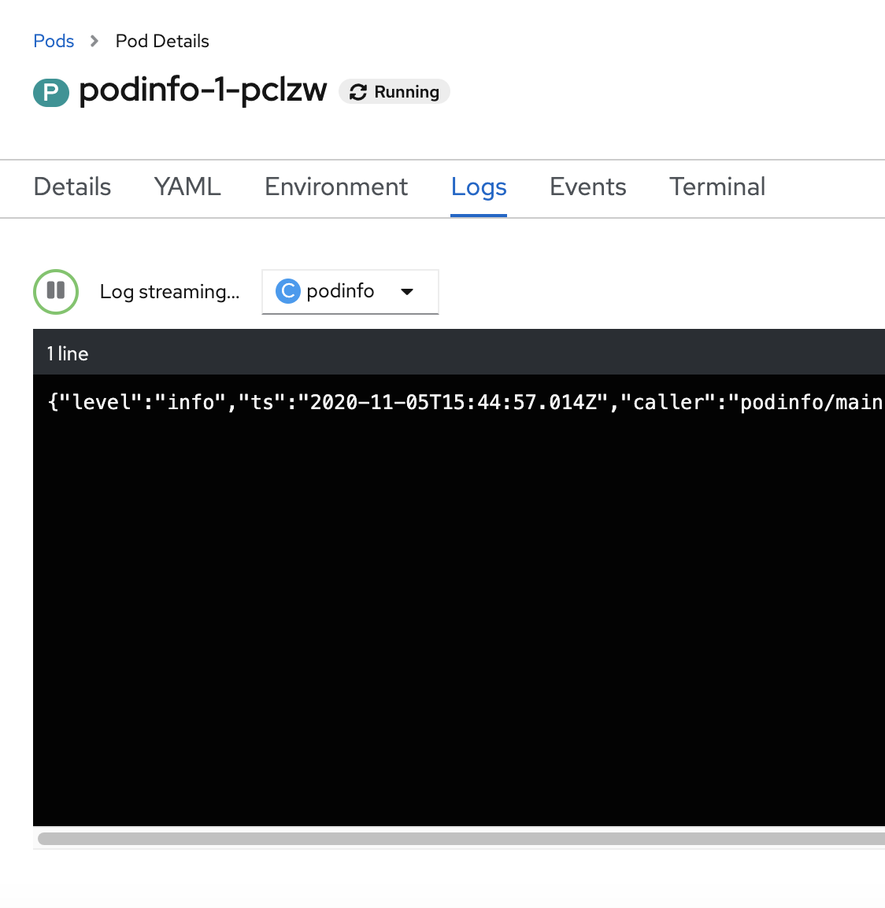

# Explorando el POD deployado

Luego de que se completó el proceso de deploy, el POD pasa al estado Running.  
Si clikeamos en el Objeto de la aplicación bajo **Topology** en la **Developer Console** podremos ver datos del POD, por ejemplo:


  

Algunos datos interesantes  

* Cantidad de PODs
* Labels
* Triggers
* Update strategy
* Etc


Además, podemos consultar los **Resources** bajo la misma interfaz.

  

Si vamos al **POD** que se crea, podemos tener acceso a los eventos de ese **POD** y a los logs:



### POD Definition - Yaml

```yaml

apiVersion: v1
kind: Pod
metadata:
  annotations:
    k8s.v1.cni.cncf.io/networks-status: |-
      [{
          "name": "openshift-sdn",
          "interface": "eth0",
          "ips": [
              "10.131.2.59"
          ],
          "dns": {},
          "default-route": [
              "10.131.2.1"
          ]
      }]
    kubernetes.io/limit-ranger: 'LimitRanger plugin set: cpu, memory request for container
      podinfo; cpu, memory limit for container podinfo'
    openshift.io/deployment-config.latest-version: "1"
    openshift.io/deployment-config.name: podinfo
    openshift.io/deployment.name: podinfo-1
    openshift.io/scc: restricted
  creationTimestamp: null
  generateName: podinfo-1-
  labels:
    deployment: podinfo-1
    deploymentconfig: podinfo
    run: podinfo
  ownerReferences:
  - apiVersion: v1
    blockOwnerDeletion: true
    controller: true
    kind: ReplicationController
    name: podinfo-1
    uid: 6fa017a9-d00f-4a2f-a70c-065277f68cfb
  selfLink: /api/v1/namespaces/taller-ocp-team1/pods/podinfo-1-pclzw
spec:
  containers:
  - image: quay.io/maurio/podinfo-openshift:latest
    imagePullPolicy: Always
    name: podinfo
    resources:
      limits:
        cpu: 100m
        memory: 512Mi
      requests:
        cpu: 100m
        memory: 512Mi
    securityContext:
      capabilities:
        drop:
        - KILL
        - MKNOD
        - SETGID
        - SETUID
      runAsUser: 1000890000
    terminationMessagePath: /dev/termination-log
    terminationMessagePolicy: File
    volumeMounts:
    - mountPath: /var/run/secrets/kubernetes.io/serviceaccount
      name: default-token-s6wnw
      readOnly: true
  dnsPolicy: ClusterFirst
  enableServiceLinks: true
  imagePullSecrets:
  - name: default-dockercfg-sfjnt
  nodeName: ovwworker-4.cap01.corp.ute.com.uy
  priority: 0
  restartPolicy: Always
  schedulerName: default-scheduler
  securityContext:
    fsGroup: 1000890000
    seLinuxOptions:
      level: s0:c30,c10
  serviceAccount: default
  serviceAccountName: default
  terminationGracePeriodSeconds: 30
  tolerations:
  - effect: NoExecute
    key: node.kubernetes.io/not-ready
    operator: Exists
    tolerationSeconds: 300
  - effect: NoExecute
    key: node.kubernetes.io/unreachable
    operator: Exists
    tolerationSeconds: 300
  - effect: NoSchedule
    key: node.kubernetes.io/memory-pressure
    operator: Exists
  volumes:
  - name: default-token-s6wnw
    secret:
      defaultMode: 420
      secretName: default-token-s6wnw
status:
  phase: Pending
  qosClass: Guaranteed
  ```
