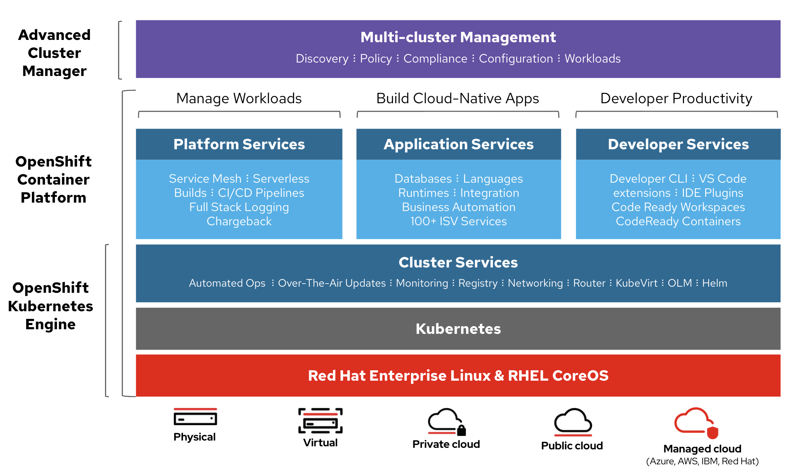

# Openshift vs Kubernetes

Openshift agrega sobre Kubernetes:  

* Developer Tools
    * Builds automatizados
    * Pipelines tradicionales (jenkins)
    * Pipelines cloud-native usando Tekton
* Concentrador de Logs
* Métricas de estado del cluster
* Registro de imágenes curadas / certificadas
* Catálogo de productos
    * Templates
    * Operators Hub
    * Helm Charts
* Seguridad
    * Políticas de acceso out-of-the-box
    * Mas restrictivo
* Despliegue automatizado e independiente de la infraestructura debajo
* Etc

  

