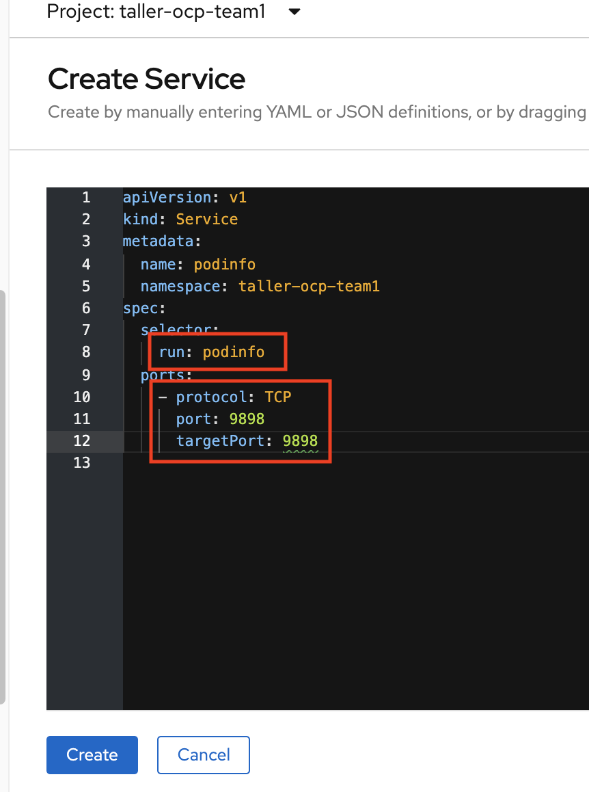
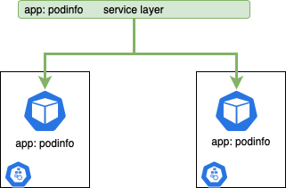

# Publicar la Aplicacion

Cabe mencionar, que cuando desplegamos una aplicación, debemos de publicarla para que pueda ser consumida.  
Si deployamos la aplicación usando la interfaz web, es posible que el objeto **service** se crea automaticamente. De todas formas, podemos crear el servicio, como si fuese un objeto mas o con simplemente con una orden en la terminal Cli.  

## Consola Web  

Para publicar el servicio basta con crear un objeto del tipo **Service** desde la consola de Administrador.

  

**¿Cómo funciona este objeto?**    

* Cada POD tiene una etiqueta que se hereda del Deployment
* Cuando se crea el service se debe referenciar usando esa etiqueta
* Todos los PODs dentro del namespace, cuya etiqueta sea la misma, serán publicados a través del Service  

  

<h2>Command Line</h2>

```yaml
$ oc expose dc/podinfo --port 9898

service/podinfo exposed
```
```yaml
$ oc get service

NAME      TYPE        CLUSTER-IP     EXTERNAL-IP   PORT(S)    AGE
podinfo   ClusterIP   172.30.31.41   <none>        9898/TCP   25s
```

```yaml
$ oc describe service podinfo

Name:              podinfo
Namespace:         taller-ocp-team1
Labels:            run=podinfo
Annotations:       <none>
Selector:          run=podinfo
Type:              ClusterIP
IP:                172.30.31.41
Port:              <unset>  9898/TCP
TargetPort:        9898/TCP
Endpoints:         10.131.2.59:9898
Session Affinity:  None
Events:            <none>
```


