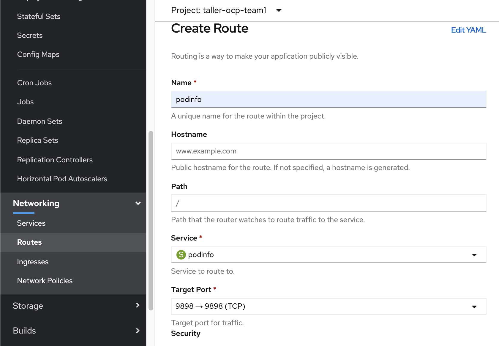

# Publicar una ruta

Publicar una ruta, implica exponer el **Servicio** creado en el ejercicio anterior. De forma análoga al service, podemos crear una ruta desde la interfaz web o desde la linea de comando.  

## Consola Web

  

## Terminal de comandos  

```yaml
oc expose svc/podinfo
route.route.openshift.io/podinfo exposed

[root@ovwbastion ~]# oc get routes
NAME      HOST/PORT                                             PATH   SERVICES   PORT   TERMINATION   WILDCARD
podinfo   podinfo-taller-ocp-team1.apps.cap01.corp.ute.com.uy          podinfo    9898                 None

```