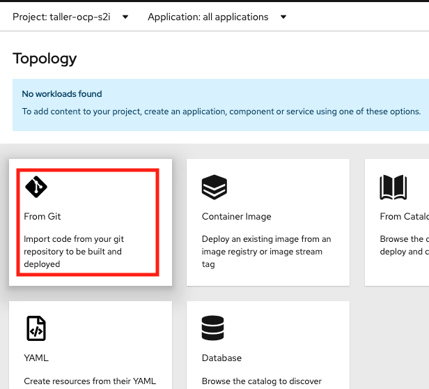
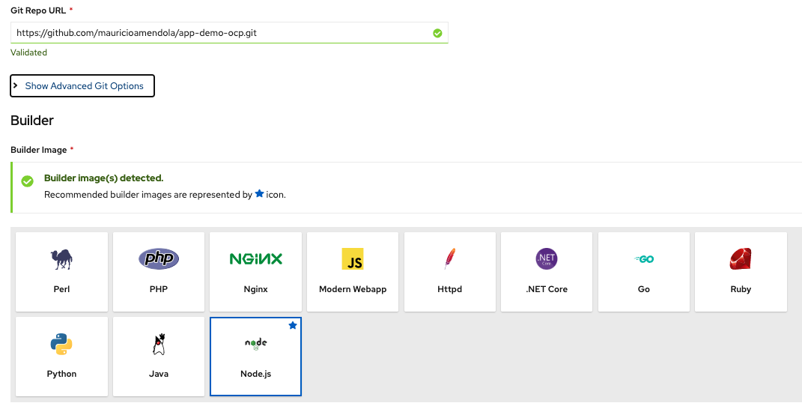
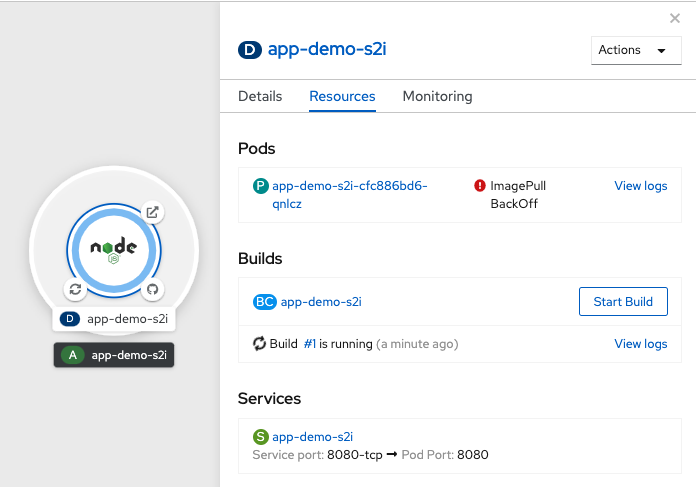
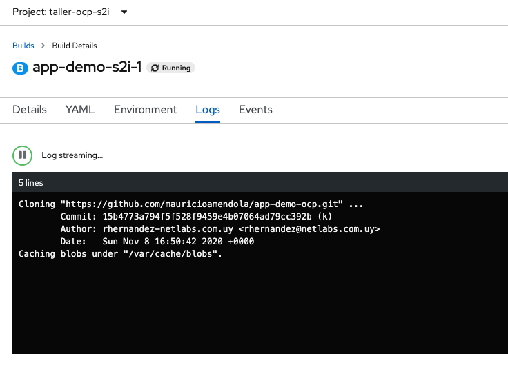
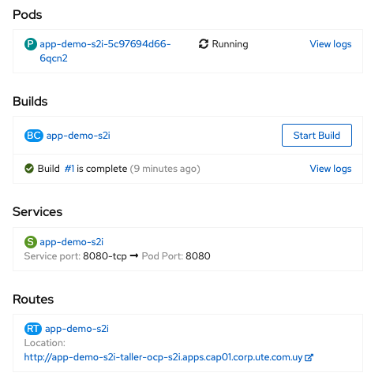

# Ejercicio: Deployar desde el Código

1. Desde la Consola de Developer

  

2. Agregar la URL del repositorio de GitHub

  

Prestar atención a lo que configura:

* Valida la url del repositorio
* Trata de identificar que Builder deberá usar para construir la imagen
* Podemos cambiar la versión del runtime del builder

3. Luego de que verificamos todo y damos al botón **Create** se crea la batería de objetos necesarios para deployar la aplicación:  
* Un POD de Build que hace el checkout de Git y llama al proceso S2I
* El POD de build crea el POD de Deploy
* El POD de Deploy crea el POD con la aplicación  

  

Consideraciones:

* El pod de Build luego de que construye la imagen finaliza y se marca como Completed
* En este proceso es normal que convivan simultaneamente dos PODs, por lo que hay que tener en cuenta que los limites aplicados al proyecto, podrían afectar el proceso de construcción del POD.
* Como se ve en la imagen, mientras se ejecuta el proceso de Build, el POD que deploya con la aplicación queda en estado "ImagePull Backoff Error" debido a que todavia no existe la imagen construida en la registry de Openshift.  

4. Mientras podemos ver el estado de Build y todos los pasos que ejecuta para ensamblar la imagen  

