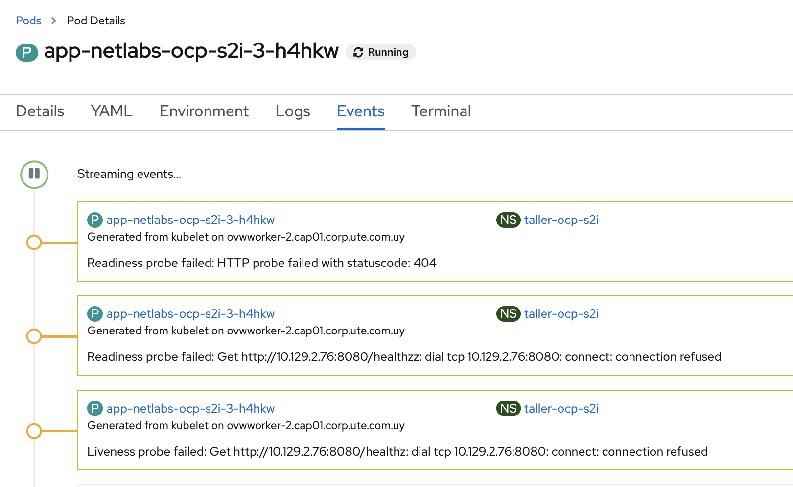
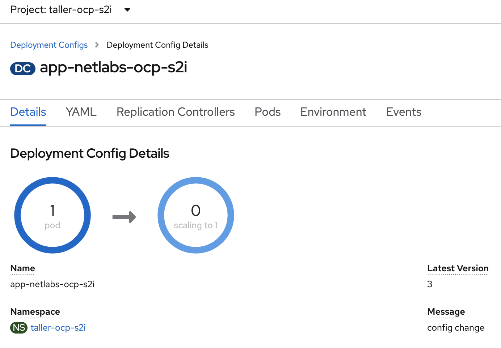

# Configurar health Checks

## Desde la interfaz gráfica


La forma de hacerlo desde la interfaz gráfica es editando el yaml del Deployment o DeploymentConfig. A partir de Openshift 4.5 se puede hacer configurando algunos parámetros desde una ventana específicamente para esto.  


```yaml
          readinessProbe:
            httpGet:
              path: /healthz
              port: 8080
            timeoutSeconds: 1
            periodSeconds: 10
            successThreshold: 1
            failureThreshold: 3
          livenessProbe:
            httpGet:
              path: /healthz
              port: 8080
            periodSeconds: 10
            successThreshold: 1
            failureThreshold: 3

```

Si el chequeo falla, en los eventos podemos ver el por qué. Se puede probar fácilmente el funcionamiento, editando el DeploymentConfig, y configurando un path que no exista, por ejemplo, en lugar de **/healthz**, colocar **/healthzzz**.  

  


