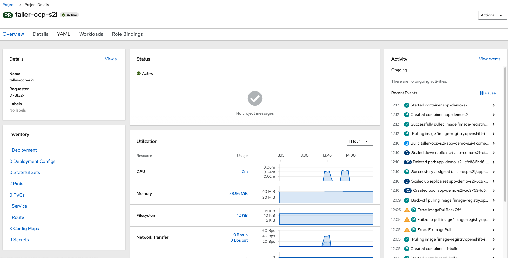
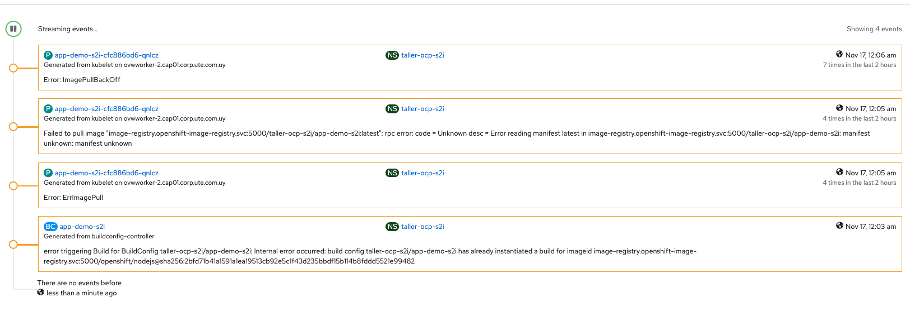
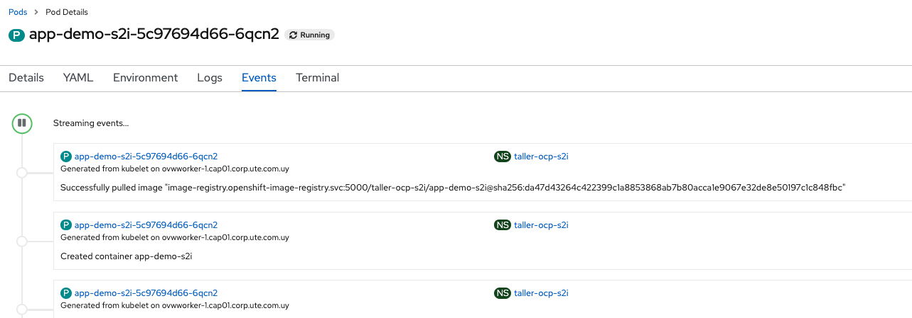

# Basicas de Troubleshooting - Eventos

Project admins y desarrolladores pueden visualizar el estado de sus aplicaciones y buscar fallas usando:  
* Eventos
    * A nivel del POD
    * A nivel del Namespace / Proyecto
* Logs
    * A nivel del POD
    * Centralizados en Kibana
  

### Eventos a nivel del Proyecto  

  

Podemos filtrar por tipo de Evento. Particularmente util cuando buscamos problemas.  

  

### Eventos a nivel del POD   

  

