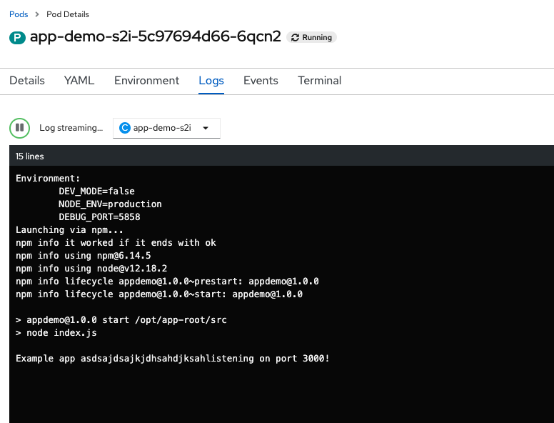
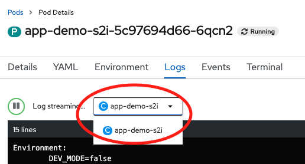
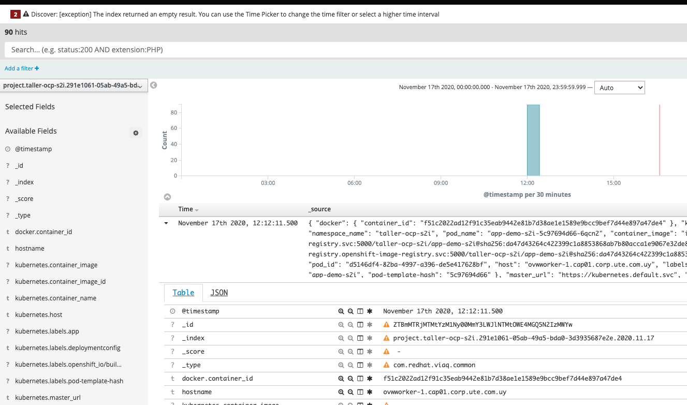

# Basicas de Troubleshooting - Logs

## Logs a nivel del POD  

  

Si el POD tiene mas de un container, podemos cambiar de container y ver el log.  

  

## Logs centralizados

Openshift viene con un concentrador de Logs listo para ser instalado y configurado mediante Operators. El stack esta compuesto por tres proyectos:

* ElasticSearch: Motor de búsqueda e indexado basado en Apache Lucene
* Fluentd: Scrapper de todos los logs que son enviados al stdout de cada container de todos los proyectos
* Kibana: Interfaz de visualización para generar las vistas / graficas y consultas a Elasticsearch

  