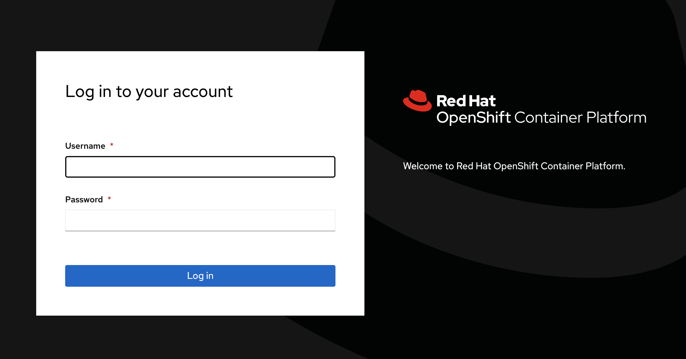

# Consola Web

Para loguearse a la consola WEB con las credenciales:

  

Openshift viene con dos consolas Web embebidas:

* Consola de Administrador
* Consola de Developer
  
## Consola de Administrador

Usuario administrador por omisión: kubeadmin

Desde cualquier browser pueden acceder via la url <openshift-url>
  
## Consola de Developer